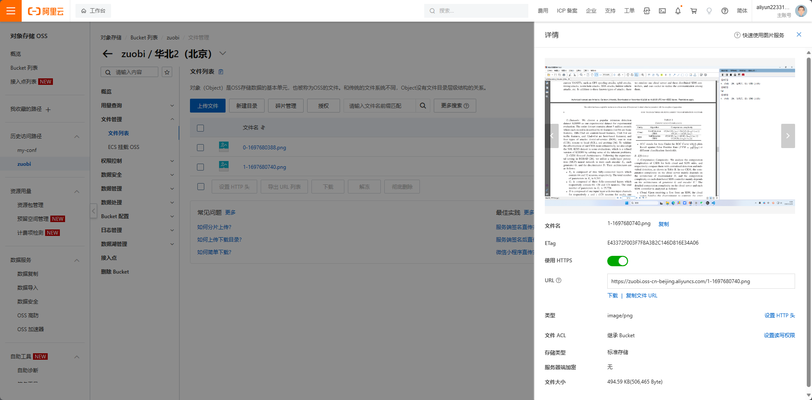

##找工作机试，一键传题目，比拍照清楚
###配置文件详情
>{
  "username" : "user1",                              //用户名
  "key": "ahu_111_xxf",           //密码
  "conf": {                         //这里填写你自己的阿里云oss
    "KeyId": "****",
    "KeySecret": "*****",
    "endpoint": "***",
    "bucket_name": "****"
  },     
  "gpt": ["****"] //你自己的chatGPT key
}
手机或电脑访问http://电脑ip：8888
手机和电脑要在一个局域网内
运行请等待10s后，按ctrl+alt+e进行截图

###
